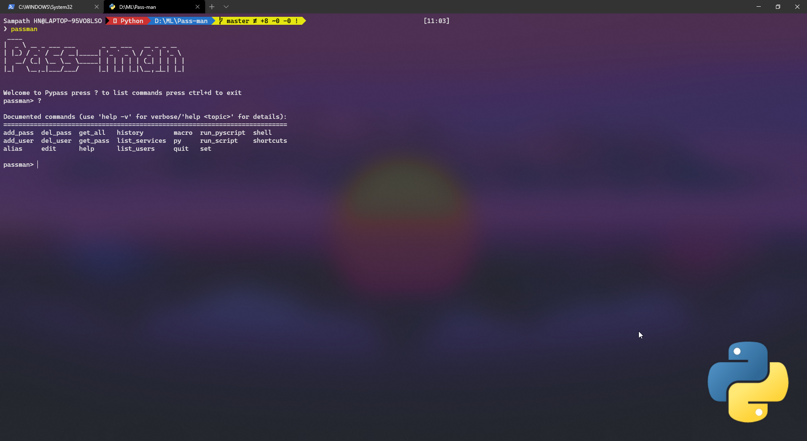
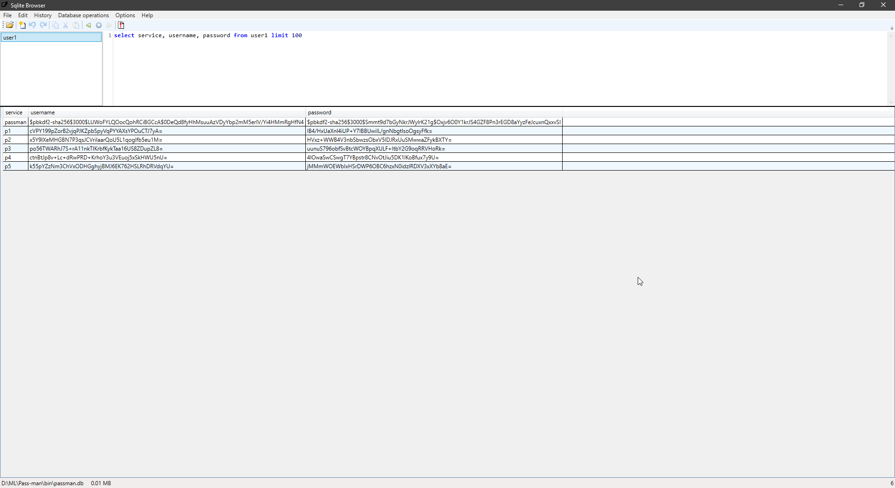

#  Pass-man


Pass-man is a simple command-line password manager with AES encryption and multiple users support.





## Installing

```
pip install My-passman
```
## how passwords are stored?

password are stored inside sqlite database each user are diffrent tables of a single
database and all passwords and usernames are AES encrypted and can only decrypted with user's master password. Hashed Master password is stored inside the database and entered password will be compared with the hashed password for authentication.


## Arguments

command-line arguments.

```
usage: passman 

  -h, --help  ,?            show this help message and exit
  add_user                add new user to My-passman
  add_pass                add new password to existing user
  list_users              lists registered users
  list_services           lists all service names of stored passwords
  get_all                 shows all the passwords and username of the user
  get_pass <service name> show password for a given service        
  del_pass <service name> delete password of service name
  del_user                delete a user
  where                   return password database location
  ctrl+d                  exit
```

## Contributions

Community contributions are a welcome addition to the project. In order to be merged upsteam any additions will need to be formatted with [black](https://black.readthedocs.io) for consistency with the rest of the project and pass the continuous integration tests run against the PR.

Bug reports are also welcome on the [issue page](https://github.com/SampathHN/My-passman/issues).
